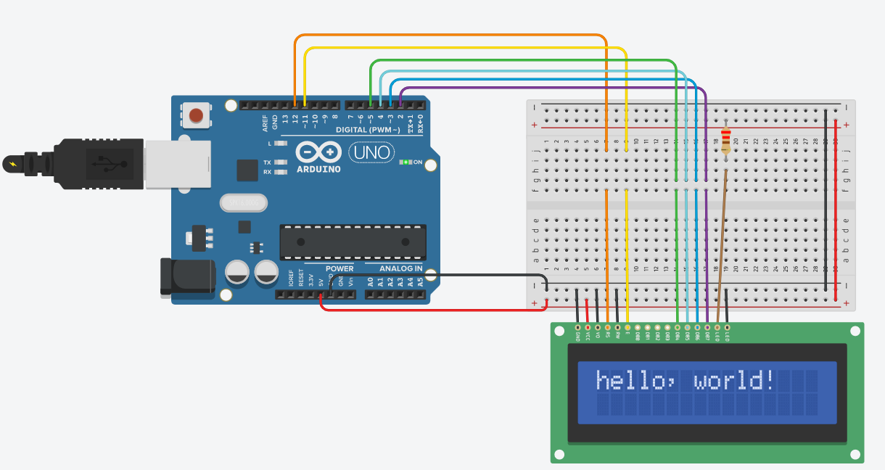
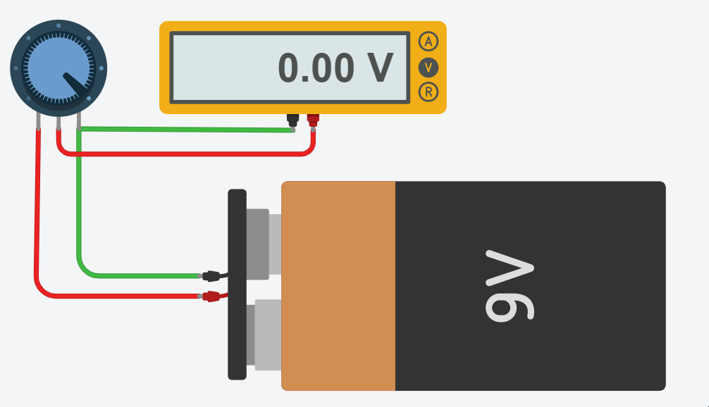
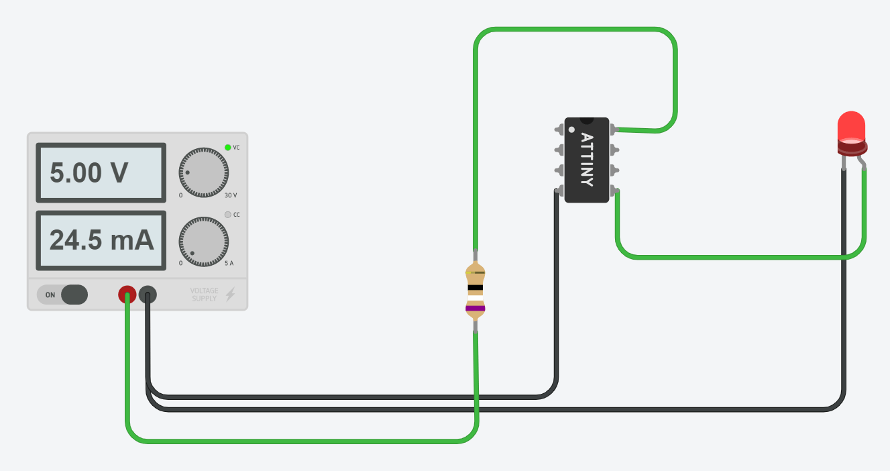
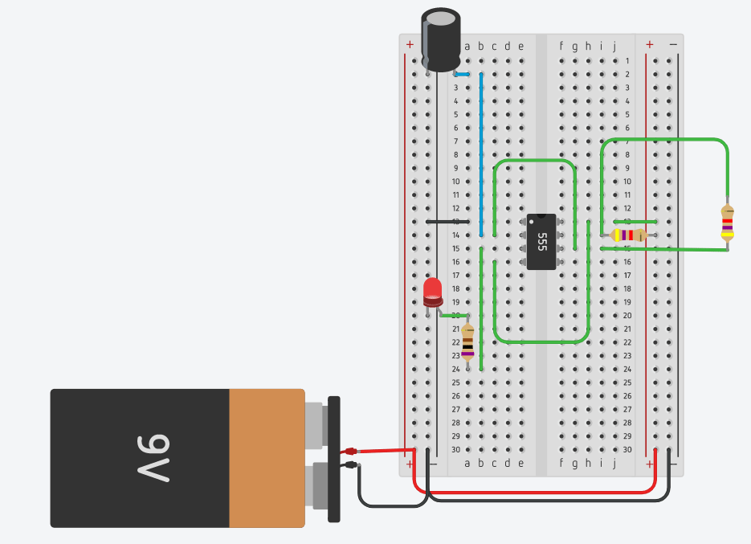
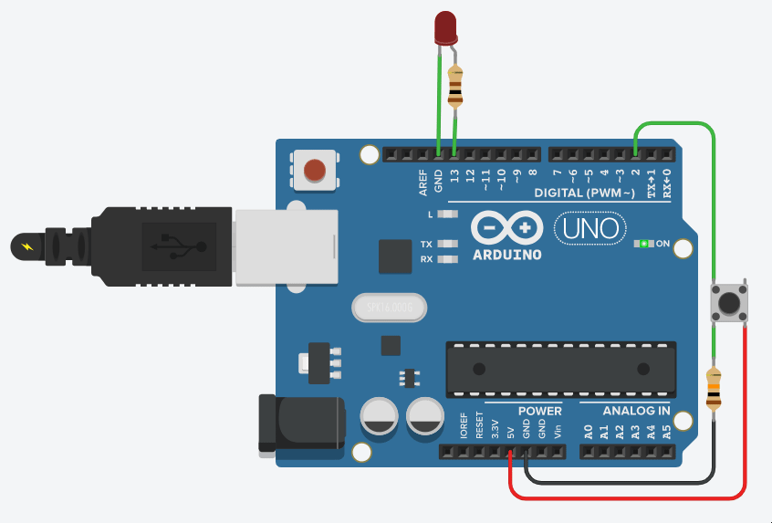

# ROBOTIX
This repository contains projects and templates related to robotics, Arduino, AVR and similar. Intention behind this repository is to provide beginners easier access to code and circuit diagrams. 
## Table of Content
* [Introduction](#introduction)
* [Potentiometer](#potentiometer)
* [ATtiny](#attiny)
* [555 timer IC](#555-timer-ic)
* [Push-Button](#push-button)
* [ATmega 2560](atmega-2560.md)
* [7-Segment Display](7-segment-display.md)
* [Motor-Drivers](motor-drivers.md)
* [Reference](#reference)

## Introduction 
You may have Arduino Board or may have not, but not having the board can't stop you from learnig cool stuff and making building future technology.
You can use [Tinkercad](https://www.tinkercad.com/) to simulate circuits. If you have board then you can download [Arduino IDE](https://www.arduino.cc/en/Main/Software) or can use Arduino Online Editor. 



## Potentiometer
Potentiometer is three-terminal device which we will use in our projects to adjust voltage. 

 
There are two terminal-pins(left and right) and one wiper(middle). Terminals are when connected to Vcc and GND (in any manner), output at the wiper will change depending upon rotation of shaft.



## ATtiny 


```c++
void setup() 
{
  pinMode(0, OUTPUT); // set pin0 as output
}

void loop()
{
  digitalWrite(0, HIGH); 
  delay(1000); // Wait for 1 second
  digitalWrite(0, LOW);
  delay(1000); // Wait for 1 second
}

```

## 555 timer IC


## Push-Button 


```C++

int buttonState = 0;

void setup()
{
  pinMode(2, INPUT);
  pinMode(13, OUTPUT);
}

void loop()
{
  buttonState = digitalRead(2);
  if (buttonState == HIGH) {
    digitalWrite(13, HIGH);
  } 
  else {
    digitalWrite(13, LOW);
  }
  delay(10); 
}
```

## Reference
* https://www.arduino.cc/
* https://www.tinkercad.com/
