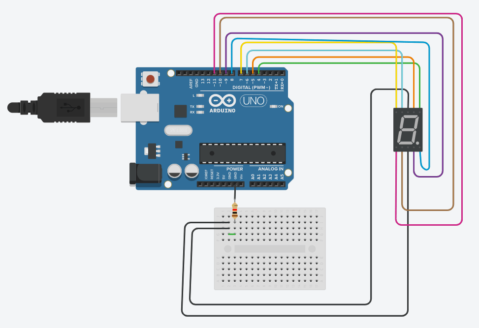

# ROBOTIX
This repository contains projects and templates related to robotics, Arduino, AVR and similar. Intention behind this repository is to provide beginners easier access to code and circuit diagrams. 
## Table of Contents
* [Introduction](#introduction)
* [ATtiny](#attiny)
* [7-Segment Display](#7-segment-display)
* [555 timer IC](#555-timer-ic)
* [Reference](#reference)

## Introduction 
You may have Arduino Board or may have not, but not having the board can't stop you from learnig cool stuff and making building future technology.
You can use [Tinkercad](https://www.tinkercad.com/) to simulate circuits. If you have board then you can download [Arduino IDE](https://www.arduino.cc/en/Main/Software) or can use Arduino Online Editor. 

## ATtiny 


```arduino
void setup() 
{
  pinMode(0, OUTPUT); // set pin0 as output
}

void loop()
{
  digitalWrite(0, HIGH); 
  delay(1000); // Wait for 1 second
  digitalWrite(0, LOW);
  delay(1000); // Wait for 1 second
}

```

## 7-Segment Display


```C++
const int a  = 5;
const int b  = 4;
const int c  = 9;
const int d  = 10;
const int e  = 11;
const int f  = 6;
const int g  = 7;
const int dp = 8;   

void clear()
{
  digitalWrite(a, LOW);
  digitalWrite(b, LOW);
  digitalWrite(c, LOW);
  digitalWrite(d, LOW);
  digitalWrite(e, LOW);
  digitalWrite(f, LOW);
  digitalWrite(g, LOW);
  digitalWrite(dp,LOW);
}
 
void displayNumber(int x) //display number
{
  switch(x)
  {
      default: 
        zero(); 
        break;
      case 1: 
        one(); 
        break;
      case 2: 
        two(); 
        break;
      case 3: 
        three(); 
        break;
      case 4: 
        four(); 
        break;
      case 5: 
        five(); 
        break;
      case 6: 
        six(); 
        break;
      case 7: 
        seven(); 
        break;
      case 8: 
        eight(); 
        break;
      case 9: 
        nine(); 
        break;
  }
}
 
void dispDec(int x)
{
  digitalWrite(dp, LOW);
}

void zero()
{
  digitalWrite(a, HIGH);
  digitalWrite(b, HIGH);
  digitalWrite(c, HIGH);
  digitalWrite(d, HIGH);
  digitalWrite(e, HIGH);
  digitalWrite(f, HIGH);
  digitalWrite(g, LOW);
}
 
void one()
{
  digitalWrite(a, LOW);
  digitalWrite(b, HIGH);
  digitalWrite(c, HIGH);
  digitalWrite(d, LOW);
  digitalWrite(e, LOW);
  digitalWrite(f, LOW);
  digitalWrite(g, LOW);
}
 
void two()
{
  digitalWrite(a, HIGH);
  digitalWrite(b, HIGH);
  digitalWrite(c, LOW);
  digitalWrite(d, HIGH);
  digitalWrite(e, HIGH);
  digitalWrite(f, LOW);
  digitalWrite(g, HIGH);
}
 
void three()
{
  digitalWrite(a, HIGH);
  digitalWrite(b, HIGH);
  digitalWrite(c, HIGH);
  digitalWrite(d, HIGH);
  digitalWrite(e, LOW);
  digitalWrite(f, LOW);
  digitalWrite(g, HIGH);
}
 
void four()
{
  digitalWrite(a, LOW);
  digitalWrite(b, HIGH);
  digitalWrite(c, HIGH);
  digitalWrite(d, LOW);
  digitalWrite(e, LOW);
  digitalWrite(f, HIGH);
  digitalWrite(g, HIGH);
}
 
void five()
{
  digitalWrite(a, HIGH);
  digitalWrite(b, LOW);
  digitalWrite(c, HIGH);
  digitalWrite(d, HIGH);
  digitalWrite(e, LOW);
  digitalWrite(f, HIGH);
  digitalWrite(g, HIGH);
}
 
void six()
{
  digitalWrite(a, HIGH);
  digitalWrite(b, LOW);
  digitalWrite(c, HIGH);
  digitalWrite(d, HIGH);
  digitalWrite(e, HIGH);
  digitalWrite(f, HIGH);
  digitalWrite(g, HIGH);
}
 
void seven()
{
  digitalWrite(a, HIGH);
  digitalWrite(b, HIGH);
  digitalWrite(c, HIGH);
  digitalWrite(d, LOW);
  digitalWrite(e, LOW);
  digitalWrite(f, LOW);
  digitalWrite(g, LOW);
}
 
void eight()
{
  digitalWrite(a, HIGH);
  digitalWrite(b, HIGH);
  digitalWrite(c, HIGH);
  digitalWrite(d, HIGH);
  digitalWrite(e, HIGH);
  digitalWrite(f, HIGH);
  digitalWrite(g, HIGH);
}
 
void nine()
{
  digitalWrite(a, HIGH);
  digitalWrite(b, HIGH);
  digitalWrite(c, HIGH);
  digitalWrite(d, HIGH);
  digitalWrite(e, LOW);
  digitalWrite(f, HIGH);
  digitalWrite(g, HIGH);
}

void setup()
{
  pinMode(a, OUTPUT);
  pinMode(b, OUTPUT);
  pinMode(c, OUTPUT);
  pinMode(d, OUTPUT);
  pinMode(e, OUTPUT);
  pinMode(f, OUTPUT);
  pinMode(g, OUTPUT);
  pinMode(dp, OUTPUT); 
}
 
void loop()
{ 
 for(int i=0; i<10; i++) 
 {
   displayNumber(i);
   delay(1000);
   clear();
 }
}
```
## 555 timer IC


## Reference
* https://www.arduino.cc/
* https://www.tinkercad.com/
