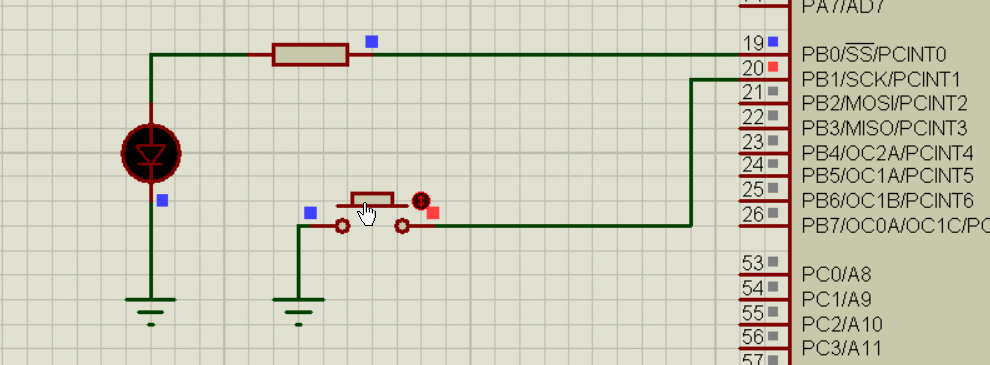

## ATmega 2560
### Button



```C++
#include <avr/io.h>
#define F_CPU 8000000
#include <util/delay.h>
int main(void)
{
	DDRB |= 1 << PINB0 ; // data direction register output PINB0
	DDRB &= ~(1<<PINB1) ; // data direction register input PINB1
	PORTB |= 1 << PINB1 ; // set PINB1 to a high reading
	
	while(1)
	{
		PORTB ^= 1 << PINB0;      // XOR (^) to toggle only pin 0 on port B
		
		if (bit_is_clear(PINB,1))  
		{
			_delay_ms(10);        // delay between toggling on and off at 100ms
		}
		else 
		{
			_delay_ms(100);      // delay between toggling on and off at 100ms
		}
	}
}
```
